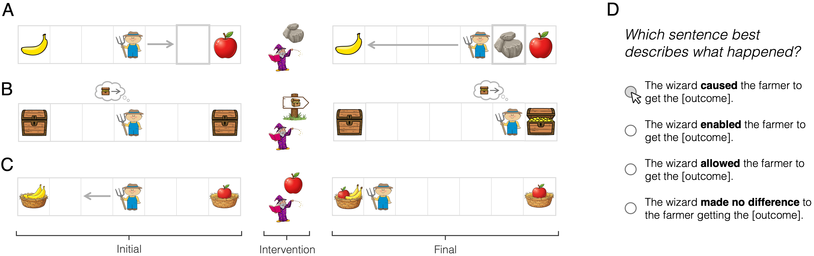

# Causal language about social interactions

This repository contains materials for the paper "Causal language about social interactions" by Verona Teo, Claire Bergey, and Tobias Gerstenberg.

## Overview



Causal language is central to our understanding of social interactions—whether someone "caused" or "allowed" another's action shifts our impression of what happened. 
Yet models of causal language use have largely focused on physical events (e.g., billiard balls), ignoring the beliefs and preferences implicated in human action.
We present a computational framework and three experiments investigating how people use causal expressions ("caused", "enabled", "allowed", and "made no difference") across physical, epistemic, and preference-based interventions between agents.
We find that people prefer different causal expressions across these intervention types: they describe removing a physical obstacle as a different form of facilitation than providing information.
We capture people's language use with a model that selects utterances based on counterfactual simulations of events, inferences about agents' mental states, and utterance informativity.
This model explains human judgments better than baseline models, suggesting that describing social influence involves reasoning about mental states, alternative actions, and alternative utterances.


## Repository

```
social-causal-lang/
├── assets/                 # Figures
├── data/                   # Human data and trials
├── docs/                   # Experiment code
└── src/  
    ├── model/              # RSA model and domain-specific implementations
    ├── analysis/           # Model fitting
    └── utils/              # Helpers  
```

## Experiments

### Preregistrations

Preregistrations for all experiments are available on the Open Science Framework (OSF):

- [Physical](https://osf.io/jc2ea/)
- [Belief](https://osf.io/p5knj/)
- [Preference](https://osf.io/rv59s/)

### Demos

- [Physical](https://cicl-stanford.github.io/social_causation/physical/speaker/)
- [Belief](https://cicl-stanford.github.io/social_causation/belief/speaker/)
- [Preference](https://cicl-stanford.github.io/social_causation/preference/speaker/)


## Setup

```bash
uv sync
uv pip install -e .
```

## Running the model

To run the full model analysis (fitting, cross-validation, and generating predictions):

```bash
uv run src/analysis/run_speaker.py
```

## CRediT author statement

| Term                       | Verona Teo | Claire Bergey | Tobias Gerstenberg |
|----------------------------|------------|---------------|--------------------|
| Conceptualization          | x          | x             | x                  |
| Methodology                | x          | x             | x                  |
| Software                   | x          |               |                    |
| Validation                 | x          |               |                    |
| Formal analysis            | x          |               |                    |
| Investigation              | x          |               |                    |
| Resources                  |            |               |                    |
| Data Curation              | x          |               |                    |
| Writing - Original Draft   | x          |               |                    |
| Writing - Review & Editing | x          | x             | x                  |
| Visualization              | x          |               |                    |
| Supervision                |            |               | x                  |
| Project administration     | x          |               | x                  |
| Funding acquisition        |            |               | x                  |